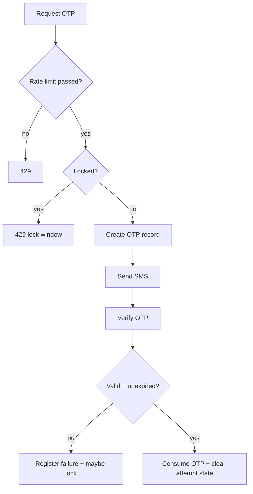
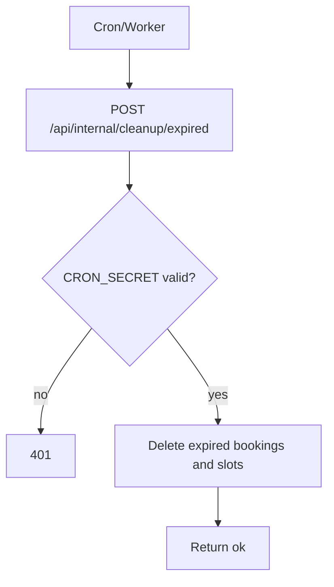
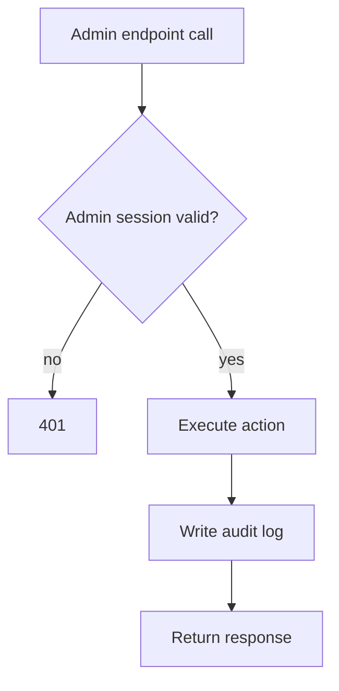

# Flow Diagrams

## OTP Flow

```mermaid
flowchart TD
A[Request OTP] --> B{Rate limit passed?}
B -- no --> X[429]
B -- yes --> C{Locked?}
C -- yes --> Y[429 lock window]
C -- no --> D[Create OTP record]
D --> E[Send SMS]
E --> F[Verify OTP]
F --> G{Valid + unexpired?}
G -- no --> H[Register failure + maybe lock]
G -- yes --> I[Consume OTP + clear attempt state]
```

## Cleanup Flow

```mermaid
flowchart TD
A[Cron/Worker] --> B[POST /api/internal/cleanup/expired]
B --> C{CRON_SECRET valid?}
C -- no --> X[401]
C -- yes --> D[Delete expired bookings and slots]
D --> E[Return ok]
```

## Admin Audit Flow

```mermaid
flowchart TD
A[Admin endpoint call] --> B{Admin session valid?}
B -- no --> X[401]
B -- yes --> C[Execute action]
C --> D[Write audit log]
D --> E[Return response]
```
